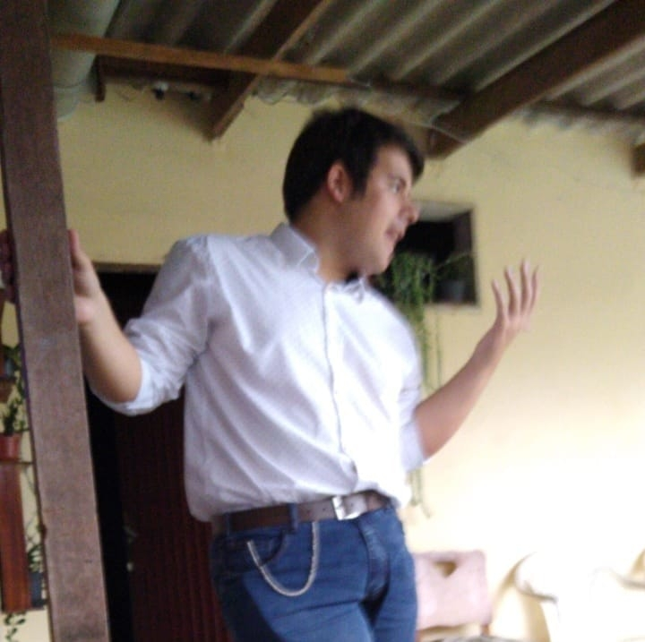

### Seja bem vindo, meu irmão ou irmã do código!

Meu nome é Eduardo de Oliveira Rosa, um programador brasileiro, também conhecido como Master Tramador.

    

---

### Leia também em: [English](./README.md), [Español](./README.ES.md)

#### Sobre mim

Tenho 21 anos, atualmente cursando Jogos Digitais no [Centro Universitário FADERGS](https://www.fadergs.edu.br/), membro da rede Laureate International Universities; e trabalhando como um Desenvolvedor de Software Web na [JD Digital](https://www.jddigital.com.br/), uma empresa de software da minha cidade. Eu também faço escrita criativa em tempo livro, tentando escrever um livro, "O Manifesto Tramadorista"; pesquiso jitos de melhorar o meu código, planejo ideias de jogos e projetos; e finalmente brinco com edição de fotos e vídeos.

Sempre tenha fé no teu código, e obrigado por passar por aqui! 📜✨💜

#### Linguagens Conhecidas

#### Já Trabalhei Com

#### Preferência de IDE

#### Redes Sociais

