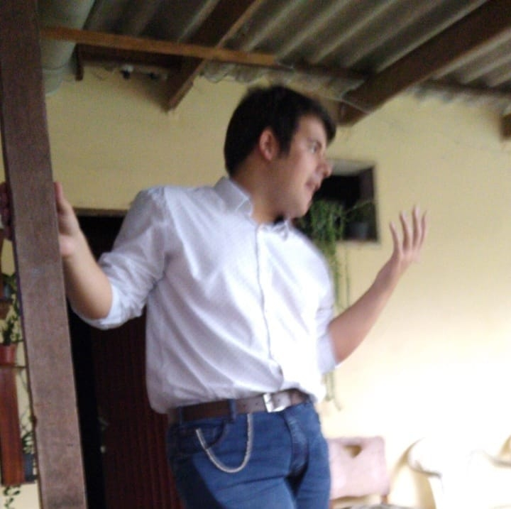

### Be welcome, my brother or sister of code!

My name is Eduardo de Oliveira Rosa, a Brazilian programmer, also known as "Mestre Tramador".

    

---

### Read it also in: [Español](./README.ES.md), [Português Brasileiro](./README.PT-BR.md)

#### About Me

I'm 21, currently studying the "Jogos Digitais" college degree at "[Centro Universitário FADERGS](https://www.fadergs.edu.br/)", member of Laureate International Universities; and working as a Web Software Developer at [JD Digital](https://www.jddigital.com.br/), a Software Company on my city. I also do creative writing on my free time and I'm trying to write a book, "O Manifesto Tramadorista"; also researching on ways to improve my code, planning games and projects ideas and finally play with photo and video editing.

Always have faith in your code, and thanks for passing by! 📜✨💜

#### Known Languages

#### Already Worked With

#### Prefered IDE

#### Social Media

